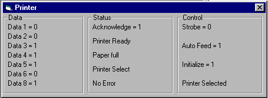



## View Printer status

### Description

View Data that go to the printer and the control strobe, select enz and view the status from the printer to the computer.

Out.dll by Denis Wiegand
 
### More Info
 

             |
---                |---
**Submitted On**   |2000-07-28 11:33:20
**By**             |[Sjaan Banaan](https://github.com/Planet-Source-Code/PSCIndex/blob/master/ByAuthor/sjaan-banaan.md)
**Level**          |Intermediate
**User Rating**    |3.5 (14 globes from 4 users)
**Compatibility**  |VB 6\.0
**Category**       |[Coding Standards](https://github.com/Planet-Source-Code/PSCIndex/blob/master/ByCategory/coding-standards__1-43.md)
**World**          |[Visual Basic](https://github.com/Planet-Source-Code/PSCIndex/blob/master/ByWorld/visual-basic.md)
**Archive File**   |[CODE\_UPLOAD82637282000\.zip](https://github.com/Planet-Source-Code/sjaan-banaan-view-printer-status__1-10149/archive/master.zip)

